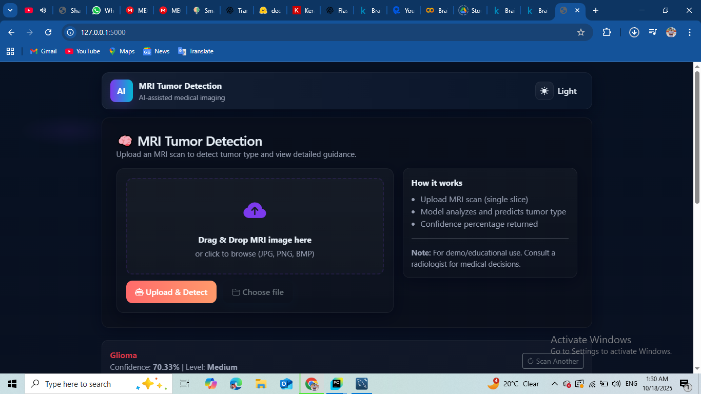
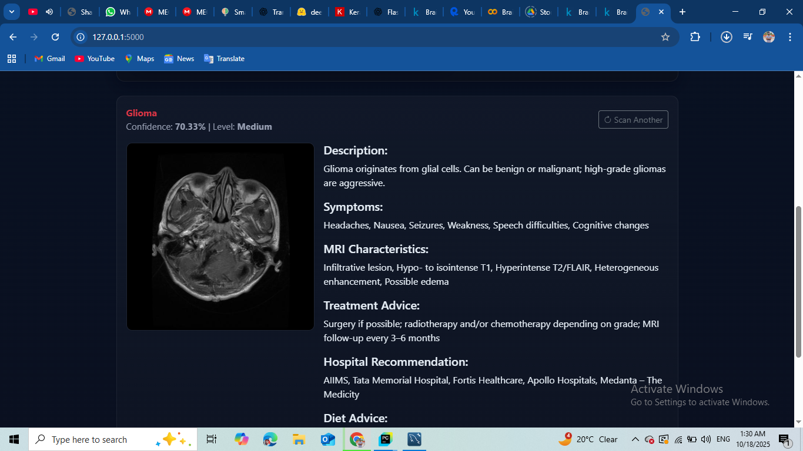
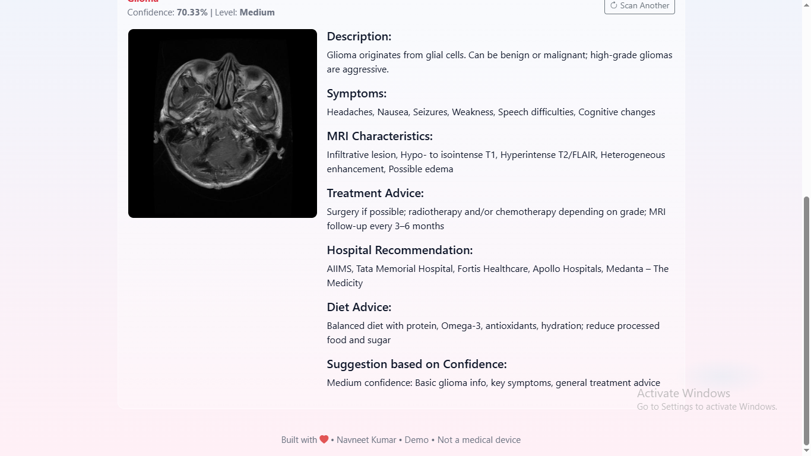
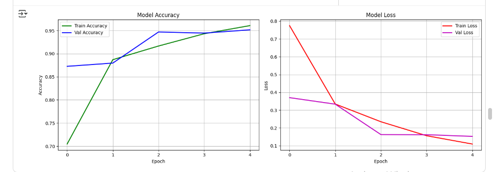
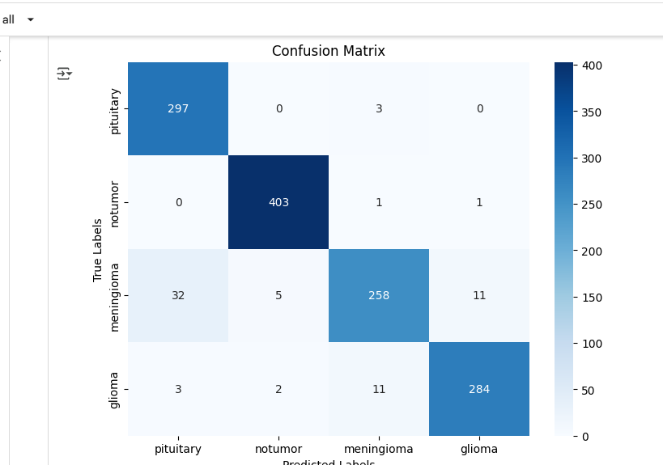

# 🧠 MRI Tumor Detection System — AI-Powered Diagnostic Tool

## Overview

The **MRI Tumor Detection System** is an **AI-powered web application** that allows users to upload brain MRI images and receive a prediction on the presence and type of tumor. The system provides confidence-based medical advice, including symptoms, MRI characteristics, treatment, diet recommendations, and hospital suggestions.

The project uses VGG16 with Transfer Learning for tumor classification and integrates MySQL for storing tumor-specific information. The UI is interactive, responsive, and supports dark/light mode, drag & drop upload, and confidence visualization.

## 🌟 Features
 - Tumor Detection

### Detects four classes:

    - Meningioma

    - Glioma

    - Pituitary Tumor

    - No Tumor

#### Returns predicted tumor type and confidence level.

## 1.Project Demo**

## 2. Confidence-based Advice

**Provides dynamic medical information based on predicted tumor:**

#### Symptoms

    - MRI characteristics

    - Treatment advice

    - Hospital recommendations

    - Diet advice

### Confidence Levels: High, Medium, Low

## 3. Interactive UI

## Drag-and-drop or file browsing for MRI images.

## Real-time preview of uploaded image.

## Dark/Light mode toggle.

## Responsive prediction card with progress bars.

## 4. Model Performance Visualization

**Accuracy & Loss Plot during training.**

**Confusion Matrix for evaluating predictions.**

## 5.MySQL Database Integration

**Stores tumor details in tumor_info table:**

    -tumor_type
    -tumor_description
    -symptoms
    -mri_characteristics
    -treatment
    -hospital_recommendation
    -diet_advice

**Fetches information dynamically when a tumor is predicted.**

# 📁 Project Structure

MRI_Tumor_Detection/

│

├── models/
│   └── model.h5      # Pretrained VGG16 + Transfer Learning

│   └── Brain_Tumor_using_deep_learning.ipynb

├── templates/

│   └── index.html               # Main Flask HTML template

├── static/

│   ├── css/

│   │   └── style.css            # Custom CSS for UI

│   └── js/

│       └── script.js            # Drag & Drop, Theme toggle, Preview

│

├── uploads/                     # Uploaded MRI images

├── main.py                      # Flask backend

├── requirements.txt             # Python dependencies

└── README.md                    # Project documentation

## 🗄️ MySQL Database Schema
CREATE DATABASE tumor_db;

USE tumor_db;

CREATE TABLE tumor_info (
    id INT AUTO_INCREMENT PRIMARY KEY,
    tumor_type VARCHAR(50) UNIQUE NOT NULL,
    tumor_description TEXT,
    symptoms TEXT,
    mri_characteristics TEXT,
    treatment TEXT,
    hospital_recommendation TEXT,
    diet_advice TEXT
);

## Sample Insert:

INSERT INTO tumor_info
(tumor_type, tumor_description, symptoms, mri_characteristics, treatment, hospital_recommendation, diet_advice)
VALUES
('meningioma', 'Meningioma is a usually benign brain tumor...', 'Headache, Seizures, Vision problems...', 'Well-circumscribed extra-axial mass...', 'Surgery and Radiotherapy...', 'AIIMS, Apollo Hospitals...', 'High-protein diet, hydration...');

## 🛠 Installation

Clone the repository:

git clone https://github.com/username/mri-tumor-detection.git
cd mri-tumor-detection

#### Create virtual environment & activate:

python -m venv venv
# Windows
venv\Scripts\activate
# Linux/Mac

source venv/bin/activate

#### Install dependencies:

pip install -r requirements.txt

#### Install MySQL

Download and install from MySQL Official

Create database and table as above.

Update main.py with your MySQL credentials.

Run Flask app:

python main.py

#### Open in browser: http://127.0.0.1:5000/

# 🚀 Technologies Used

**Frontend:** HTML, CSS, Bootstrap, JavaScript

**Backend:** Flask, Python

**Machine Learning:** TensorFlow, Keras, VGG16 Pretrained + Transfer Learning

**Database:** MySQL

**Visualization:** Matplotlib, Seaborn

## 🎯 Future Enhancements

Multi-slice MRI processing for better predictions.

PDF report generation with prediction & advice.

User authentication & scan history.

Expand dataset for higher accuracy.

AI-powered diet & lifestyle recommendations.

## 📚 References

Keras VGG16 Documentation

Flask Documentation

MySQL Documentation

Brain Tumor MRI Dataset (Kaggle)

# Credits

**Developed by:** Navneet Kumar

**Deep Learning Reference:** TensorFlow/Keras, VGG16

**Dataset sources:** Publicly available MRI brain tumor datasets

# Contribution

This project is open source and contributions are welcome!

Add more tumor types and medical recommendations.

Improve UI/UX and dark/light mode features.

Optimize model and database integration.

Feel free to fork the repo, create pull requests, and contribute to make it better.